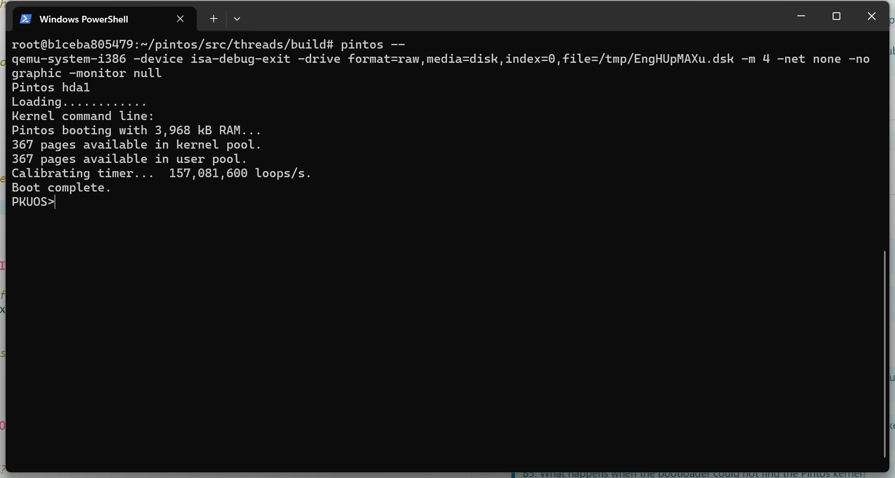

# Project 0: Getting Real

## Preliminaries

>Fill in your name and email address.

Qingyuan Wang<2200013187@stu.pku.edu.cn>

>If you have any preliminary comments on your submission, notes for the TAs, please give them here.

>Please cite any offline or online sources you consulted while preparing your submission, other than the Pintos documentation, course text, lecture notes, and course staff.

## Booting Pintos

>A1: Put the screenshot of Pintos running example here.

## Debugging

#### QUESTIONS: BIOS 

>B1: What is the first instruction that gets executed?  
ljmp   $0x3630,$0xf000e05b  

>B2: At which physical address is this instruction located?  
0xffff0

#### QUESTIONS: BOOTLOADER

>B3: How does the bootloader read disk sectors? In particular, what BIOS interrupt is used?  
Use interrupt 0x13 to read disk sectors.
Ah=42.IBM/MS INT 13 Extensions - EXTENDED READ

>B4: How does the bootloader decides whether it successfully finds the Pintos kernel?  
check if the partition is a used partition, kernel parition, bootable partition.

>B5: What happens when the bootloader could not find the Pintos kernel?  
Call Interrupt 0x18,boot failed, output"Not found".

>B6: At what point and how exactly does the bootloader transfer control to the Pintos kernel?  
When kernel is loaded successfully.
Jump to the start address.

#### QUESTIONS: KERNEL

>B7: At the entry of pintos_init(), what is the value of expression `init_page_dir[pd_no(ptov(0))]` in hexadecimal format?  
0x0

>B8: When `palloc_get_page()` is called for the first time,

>> B8.1 what does the call stack look like?  
>>#0  palloc_get_page (flags=(PAL_ASSERT | PAL_ZERO)) at ../../threads/palloc.c:112  
>>#1  0xc002056e in paging_init () at ../../threads/init.c:222  
>>#2  0xc002031b in pintos_init () at ../../threads/init.c:100  
>>#3  0xc002013d in start () at ../../threads/start.S:180  
>> 

>> B8.2 what is the return value in hexadecimal format?  
>> 0xc0101000
>> 

>> B8.3 what is the value of expression `init_page_dir[pd_no(ptov(0))]` in hexadecimal format?  
>>0x0
>> 

>B9: When palloc_get_page() is called for the third time,

>> B9.1 what does the call stack look like?  
>>#0  palloc_get_page (flags=PAL_ZERO) at ../../threads/palloc.c:112  
>>#1  0xc0020c6d in thread_create (name=0xc002ea9d "idle", priority=0 function=0xc002109c <idle>, aux=0xc000ef8c) at ../../threads/thread.c:178  
>>#2  0xc0020b3a in thread_start () at ../../threads/thread.c:111  
>>#3  0xc0020334 in pintos_init () at ../../threads/init.c:119  
>>#4  0xc002013d in start () at ../../threads/start.S:180  
>> 

>> B9.2 what is the return value in hexadecimal format?  
>>0xc0103000
>> 

>> B9.3 what is the value of expression `init_page_dir[pd_no(ptov(0))]` in hexadecimal format?  
>> 0x102027
>> 

## Kernel Monitor

>C1: Put the screenshot of your kernel monitor running example here. (It should show how your kernel shell respond to `whoami`, `exit`, and `other input`.)

#### 

>C2: Explain how you read and write to the console for the kernel monitor.  
Use input and output functions provided in lib/kernel/console.c, lib/stdio.c and devices/input.c.  
When input is 'whoami' or 'exit', react correspondingly.